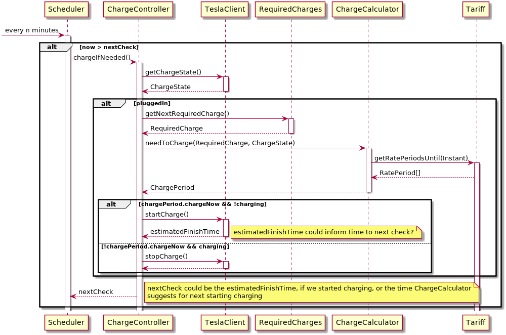

## Clever Charger

A project to semi-intelligently decide the most appropriate time to charge an EV, based on electricity tariffs and planned/regular journeys.

Weekly schedules and individual exceptions are set via RESTful endpoints.

To schedule a specific state of charge at a specific time on a weekly basis:

```HTTP
POST /schedules/weekly HTTP/1.1
Content-Type: application/json

{
    "day": "THURSDAY",
    "time": "06:00",
    "chargeLevel": 85
}
```

To set an exception for a specific date and time:

```HTTP
POST /schedules/exception HTTP/1.1
Content-Type: application/json

{
    "dateTime": "2021-01-23T15:40:01Z",
    "chargeLevel": 50
}
```

To get all future schedules and exceptions:

```HTTP
GET /schedules HTTP/1.1
```

## Initial Design

